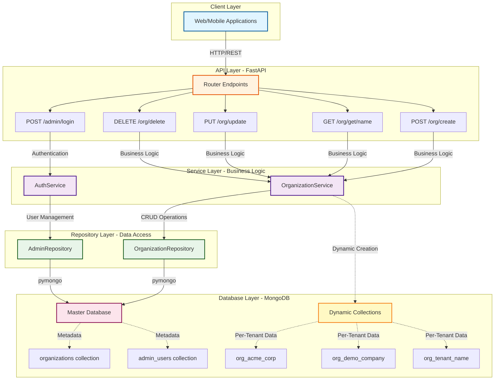

# Croupier
**Backend Intern Assignment - The Wedding Company**

---

**Author:** Vibhor Srivastava  
**Institution:** SRM Institute of Science and Technology, NCR Campus  
**Submission Date:** December 13, 2025

---

## About the Project Name

**Croupier** (French: /kʁupje/, meaning "dealer") - In casinos, a croupier manages and distributes resources at gaming tables. Similarly, this service acts as the central dealer for managing and distributing organizational resources across multiple tenants, ensuring fair isolation and proper resource allocation in a multi-tenant architecture.

## Executive Summary

Croupier is an enterprise-grade, multi-tenant organization management service designed to demonstrate modern backend development practices. Built with FastAPI and MongoDB, it provides a scalable solution for managing organizations with complete data isolation, robust authentication, and dynamic resource provisioning.

**Key Capabilities:**
- RESTful API for organization lifecycle management (CRUD operations)
- JWT-based authentication with bcrypt password security
- Dynamic MongoDB collection creation per tenant
- Master database for global metadata with isolated tenant databases
- Production-ready architecture with layered design pattern

## High-Level Architecture Diagram



**Architecture Principles:**
- **Layered Design:** Clear separation of concerns (Router → Service → Repository → Database)
- **Multi-Tenancy:** Isolated MongoDB collections per organization (`org_<name>`)
- **Security-First:** JWT authentication with bcrypt password hashing (12 rounds)
- **Scalability:** Stateless design enabling horizontal scaling

## Detailed Architecture Analysis

> **Important:** The architectural questions from the assignment (scalability limitations, technology trade-offs, alternative database patterns) are comprehensively answered in the accompanying Jupyter notebook.

For in-depth technical documentation including:
- **Design rationale and architectural decisions**
- **Scalability analysis and limitations**
- **Technology stack trade-offs**
- **Alternative multi-tenancy patterns comparison**
- **Production readiness considerations**
- **Code examples and implementation details**

**Please refer to:** [`Croupier_Architecture.ipynb`](Croupier_Architecture.ipynb)

## Tech Stack

- **Language:** Python 3.8+
- **Framework:** FastAPI
- **Database:** MongoDB
- **Authentication:** JWT (JSON Web Tokens)
- **Password Hashing:** bcrypt
- **Driver:** pymongo

## Setup Instructions

1.  **Clone the repository:**
    ```bash
    git clone <repository-url>
    cd croupier
    ```

2.  **Create a virtual environment:**
    ```bash
    python -m venv venv
    source venv/bin/activate  # On Windows: venv\Scripts\activate
    ```

3.  **Install dependencies:**
    ```bash
    pip install -r requirements.txt
    ```

4.  **Configure Environment Variables:**
    Copy the example environment file and configure it:
    ```bash
    cp .env.example .env
    ```
    
    Then edit `.env` with your settings:
    ```env
    APP_NAME=Croupier
    DEBUG=True
    MONGODB_URL=mongodb://localhost:27017
    MONGODB_DB_NAME=croupier_master
    JWT_SECRET_KEY=your-super-secret-key-change-this
    JWT_ALGORITHM=HS256
    JWT_ACCESS_TOKEN_EXPIRE_MINUTES=60
    ```

5.  **Run MongoDB:**
    You can use either:
    - **MongoDB Atlas (Cloud)**: Follow `ATLAS_SETUP.md` for step-by-step cloud setup
    - **Local MongoDB**: Install MongoDB Community Edition and run on port 27017
    
    Update `MONGODB_URL` in `.env` accordingly.

## How to Run the Server

Start the application using Uvicorn:

```bash
uvicorn main:app --reload
```

The server will start at `http://localhost:8000`.

## API Documentation

FastAPI provides automatic interactive documentation:

- **Swagger UI:** [http://localhost:8000/docs](http://localhost:8000/docs)
- **ReDoc:** [http://localhost:8000/redoc](http://localhost:8000/redoc)

### Key Endpoints

- **POST /org/create**: Create a new organization with admin user
- **GET /org/get**: Retrieve organization details by name (query parameter)
- **PUT /org/update**: Update organization details (Auth required)
- **DELETE /org/delete**: Delete authenticated admin's organization (Auth required)
- **POST /admin/login**: Admin login to get JWT token

## Usage Examples

### 1. Create an Organization

```bash
curl -X 'POST' \
  'http://localhost:8000/org/create' \
  -H 'Content-Type: application/json' \
  -d '{
  "organization_name": "acme_corp",
  "email": "admin@acme.com",
  "password": "StrongPassword123"
}'
```

### 2. Get Organization Details

```bash
curl -X 'GET' \
  'http://localhost:8000/org/get?organization_name=acme_corp'
```

### 3. Login as Admin

```bash
curl -X 'POST' \
  'http://localhost:8000/admin/login' \
  -H 'Content-Type: application/json' \
  -d '{
  "email": "admin@acme.com",
  "password": "StrongPassword123"
}'
```

### 4. Update Organization (Authenticated)

```bash
curl -X 'PUT' \
  'http://localhost:8000/org/update' \
  -H 'Authorization: Bearer <YOUR_TOKEN>' \
  -H 'Content-Type: application/json' \
  -d '{
  "organization_name": "acme_global",
  "email": "newemail@acme.com",
  "password": "NewPassword456"
}'
```

### 5. Delete Organization (Authenticated)

```bash
curl -X 'DELETE' \
  'http://localhost:8000/org/delete' \
  -H 'Authorization: Bearer <YOUR_TOKEN>'
```

## Validation & Error Handling

The API includes comprehensive validation:

### Password Requirements
- Minimum 8 characters
- At least one uppercase letter
- At least one lowercase letter
- At least one digit

**Example Error Response:**
```json
{
  "detail": [
    {
      "loc": ["body", "password"],
      "msg": "Password must contain at least one uppercase letter",
      "type": "value_error"
    }
  ]
}
```

### Organization Name Requirements
- 3-50 characters
- Only alphanumeric, underscores, and hyphens
- Automatically converted to lowercase
- Must be unique

**Example Error Response:**
```json
{
  "detail": "Organization 'acme_corp' already exists"
}
```

### Authentication Errors
**401 Unauthorized:**
```json
{
  "detail": "Invalid authentication token"
}
```

**403 Forbidden:**
```json
{
  "detail": "Could not validate credentials"
}
```

## Architecture and Design

See **[Croupier_Architecture_and_Design.pdf](Croupier_Architecture_and_Design.pdf)** for the high-level diagram, detailed design rationale, and answers to architectural questions.

## Assumptions

- MongoDB is running as a standalone instance (transactions not used).
- Organization names are unique globally.
- "Dynamic collection" implies creating a separate MongoDB collection for each tenant (e.g., `org_acme`).
- Data migration during organization rename is done synchronously (for simplicity). In a production environment with large datasets, this should be an asynchronous background task.
