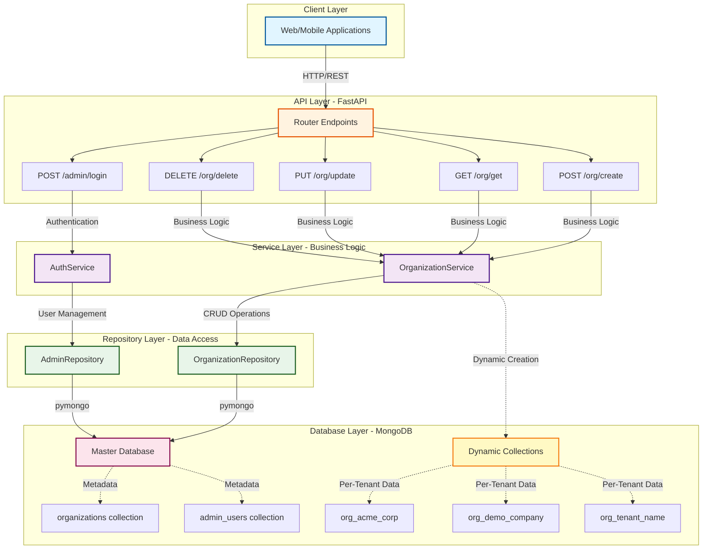

# Croupier – Multi-Tenant Organization Management Service

**Backend Intern Assignment | The Wedding Company**  
*Vibhor Srivastava • SRM IST NCR Campus • December 13, 2025*

---

## Overview

**Croupier** (French: /kʁupje/, meaning "dealer") – In casinos, a croupier manages and distributes resources at gaming tables. Similarly, this service acts as the central dealer for managing and distributing organizational resources across multiple tenants, ensuring fair isolation and proper resource allocation in a multi-tenant architecture.

**Croupier** is a production-ready multi-tenant organization management API built with FastAPI and MongoDB. It demonstrates enterprise backend patterns including JWT authentication, per-tenant data isolation via dynamic collections, and layered architecture for maintainability and scalability.

**Local-First Execution Rationale:**  
Croupier is intentionally designed for local evaluation to guarantee reproducibility, eliminate hosting dependencies, and align with assignment expectations. Full functionality, including automated testing and smoke tests, runs reliably without cloud services. This approach ensures evaluators can validate all requirements in a deterministic environment.

**Core Capabilities:**
- Organization lifecycle management (create, read, update, delete)
- JWT-based authentication with bcrypt password hashing (12 rounds)
- Collection-per-tenant multi-tenancy (isolated MongoDB collections)
- Master database for metadata + dynamic per-organization collections
- Automated testing suite and smoke test script

---

## Architecture



**Design Principles:**
- **Layered Architecture:** Router → Service → Repository → Database (clear separation of concerns)
- **Multi-Tenancy:** Collection-per-tenant pattern with `org_<name>` dynamic collections
- **Stateless Authentication:** JWT tokens enable horizontal scaling without session storage
- **Security-First:** bcrypt password hashing (12 rounds) + bearer token validation

**In-Depth Analysis:**  
For comprehensive architectural documentation including scalability limitations, technology trade-offs, and alternative patterns, see [`Croupier_Architecture.ipynb`](Croupier_Architecture.ipynb)

---

## Features & Capabilities

✅ **Organization Lifecycle Management**  
Complete CRUD operations for organization creation, retrieval, update (with collection migration), and deletion

✅ **JWT Authentication**  
Stateless bearer token authentication with automatic token validation on protected endpoints

✅ **Per-Tenant Data Isolation**  
Each organization receives a dedicated MongoDB collection (`org_<name>`) ensuring complete data segregation

✅ **Master Metadata Database**  
Centralized `croupier_master` database storing organization registry and admin credentials

✅ **Security & Validation**  
Password strength requirements (8+ chars, uppercase, lowercase, digit) + email validation + input sanitization

✅ **Automated Testing**  
Comprehensive pytest suite (20 tests) + smoke test script for rapid validation

**Tech Stack:** Python 3.8+ • FastAPI • MongoDB • JWT • bcrypt • pymongo

---

## Quick Start (Evaluator-Friendly)

### Option A: Docker (Recommended)
```bash
# 1. Setup environment
cp .env.example .env

# 2. Start entire system (API + MongoDB)
docker-compose up --build

# 3. Verify health
curl http://localhost:8000/health
```

**Access interactive docs:** [http://localhost:8000/docs](http://localhost:8000/docs)

### Option B: Local Development
```bash
# 1. Setup environment
cp .env.example .env
python -m venv venv
source venv/bin/activate  # Windows: venv\Scripts\activate

# 2. Install dependencies
pip install -r requirements.txt

# 3. Start server
uvicorn main:app --reload
```

**Note:** Requires MongoDB running locally or via Atlas. Update `MONGODB_URL` in `.env` accordingly.

---

## Smoke Test (Fast Evaluation)

Run the automated smoke test to verify all functionality in seconds:

```bash
./smoke_test.sh
# Windows: bash smoke_test.sh
```

**What it validates:**
1. ✅ POST /org/create – Organization creation with admin
2. ✅ POST /admin/login – JWT token generation
3. ✅ GET /org/get – Organization retrieval
4. ✅ PUT /org/update – Organization rename + collection migration
5. ✅ DELETE /org/delete – Organization and collection cleanup
6. ✅ Verification – Confirms complete deletion

**Expected Output:** `ALL SMOKE TESTS PASSED!` with colored status indicators

**Alternative:** Import [`examples/Croupier_Postman_Collection.json`](examples/Croupier_Postman_Collection.json) for manual interactive testing

---

## API Summary

| Endpoint | Method | Auth Required | Description |
|----------|--------|---------------|-------------|
| `/org/create` | POST | ❌ No | Create organization with admin credentials |
| `/org/get?organization_name=<name>` | GET | ❌ No | Retrieve organization metadata by name |
| `/org/update` | PUT | ✅ Yes | Update organization (triggers collection migration on rename) |
| `/org/delete` | DELETE | ✅ Yes | Delete organization and associated collection |
| `/admin/login` | POST | ❌ No | Authenticate admin and receive JWT token |
| `/health` | GET | ❌ No | Health check endpoint |

**Interactive API Docs:**
- Swagger UI: [http://localhost:8000/docs](http://localhost:8000/docs)
- ReDoc: [http://localhost:8000/redoc](http://localhost:8000/redoc)

---

## Usage Examples

<details>
<summary><strong>Show curl Examples</strong></summary>

### 1. Create Organization
```bash
curl -X 'POST' \
  'http://localhost:8000/org/create' \
  -H 'Content-Type: application/json' \
  -d '{
  "organization_name": "acme_corp",
  "email": "admin@acme.com",
  "password": "StrongPassword123"
}'
```

### 2. Get Organization Details
```bash
curl -X 'GET' \
  'http://localhost:8000/org/get?organization_name=acme_corp'
```

### 3. Admin Login
```bash
curl -X 'POST' \
  'http://localhost:8000/admin/login' \
  -H 'Content-Type: application/json' \
  -d '{
  "email": "admin@acme.com",
  "password": "StrongPassword123"
}'
```

### 4. Update Organization (Authenticated)
```bash
curl -X 'PUT' \
  'http://localhost:8000/org/update' \
  -H 'Authorization: Bearer <YOUR_TOKEN>' \
  -H 'Content-Type: application/json' \
  -d '{
  "organization_name": "acme_global",
  "email": "newemail@acme.com",
  "password": "NewPassword456"
}'
```

### 5. Delete Organization (Authenticated)
```bash
curl -X 'DELETE' \
  'http://localhost:8000/org/delete' \
  -H 'Authorization: Bearer <YOUR_TOKEN>'
```

</details>

---

## Testing

Run the comprehensive test suite:

```bash
pytest              # Run all 20 tests
pytest -v           # Verbose output
pytest tests/test_organization.py  # Specific test file
```

**Test Coverage:**
- Organization CRUD operations with validation
- JWT authentication and token expiry
- Protected endpoint authorization checks
- Error handling and status codes
- Health check endpoint

**Expected Result:** ✅ 20/20 tests pass

See [`tests/README.md`](tests/README.md) for detailed documentation.

---

## Local-First Design Rationale

This project prioritizes **local reproducibility over cloud deployment** for three key reasons:

1. **Deterministic Evaluation Environment**  
   Every reviewer runs identical infrastructure (Docker + MongoDB) eliminating environment-specific issues and ensuring consistent behavior validation.

2. **Assignment Scope Alignment**  
   Backend intern assessment focuses on code architecture, API design, and data modeling—not DevOps or cloud infrastructure management.

3. **Cost-Free Demo Capability**  
   Docker Compose + automated tests + smoke scripts provide complete functional demonstration without ongoing hosting expenses or credential sharing.

**Production-Ready Infrastructure:** Despite local-first design, this project includes Docker support, health checks, and environment configuration for seamless deployment to Railway, Azure App Service, AWS ECS, or any container platform.

**Optional Public Access:** For remote demos, use [ngrok](https://ngrok.com/) to create temporary tunnels: `ngrok http 8000`

---

## Validation & Error Handling

<details>
<summary><strong>Show Validation Rules & Error Responses</strong></summary>

### Password Requirements
- Minimum 8 characters
- At least one uppercase letter, lowercase letter, and digit

**Error Response:**
```json
{
  "detail": [
    {
      "loc": ["body", "password"],
      "msg": "Password must contain at least one uppercase letter",
      "type": "value_error"
    }
  ]
}
```

### Organization Name Requirements
- 3-50 characters, alphanumeric + underscores/hyphens
- Automatically lowercased, must be globally unique

**Error Response:**
```json
{
  "detail": "Organization 'acme_corp' already exists"
}
```

### Authentication Errors
**401 Unauthorized:** Invalid or missing JWT token  
**403 Forbidden:** Valid token but insufficient permissions

</details>

---

## Files of Interest

- **[Croupier_Architecture.ipynb](Croupier_Architecture.ipynb)** – Comprehensive architecture analysis and design decisions
- **[examples/Croupier_Postman_Collection.json](examples/Croupier_Postman_Collection.json)** – Import-ready API collection
- **[examples/responses/](examples/responses/)** – Example JSON responses for all endpoints
- **[tests/](tests/)** – Comprehensive pytest suite (20 tests, see [tests/README.md](tests/README.md))
- **smoke_test.sh** – Automated end-to-end validation script
- **start-local.sh** – One-command startup helper

---

## Assumptions & Notes

- **MongoDB Standalone:** No multi-document transactions (single-document atomicity sufficient for current operations)
- **Global Uniqueness:** Organization names must be unique across all tenants
- **Collection-per-Tenant:** Each organization receives dedicated MongoDB collection (`org_<name>`)
- **Synchronous Migration:** Organization rename triggers immediate data migration (production systems with large datasets should use async task queues)
- **Simulated Connection Details:** `connection_details` field demonstrates metadata storage pattern (replace with actual connection logic in production)

---

**Repository:** https://github.com/Vibhor2702/Croupier  
**Contact:** Vibhor Srivastava • SRM IST NCR Campus
